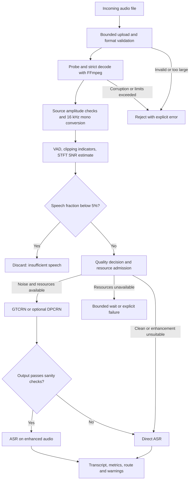

# Audio Diagnostic and Dynamic Routing Implementation Plan

> **For agentic workers:** Use `superpowers:executing-plans` to implement this plan task by task. Steps use checkboxes for tracking.

**Goal:** Accept an audio file, validate and standardize it, measure speech/noise/clipping, and either discard it, transcribe it directly, or enhance it before transcription.

**Architecture:** Extend the existing FastAPI backend with a file-based audio API and one supervised inference worker process. Run validation and diagnostics on the CPU, serialize model execution, and use measured resource availability to select an execution path. Keep all processing local by default.

**Tech stack:** Python, FastAPI, FFmpeg/ffprobe, NumPy/SciPy, Silero VAD, GTCRN, optional DPCRN, faster-whisper, SQLite job metadata, and optional NVML telemetry.

**Spec:** This document contains both the low-level design and the implementation plan for the supplied three-stage pipeline. Numerical thresholds below are initial engineering defaults to validate, not established accuracy or latency claims.

## 1. Scope and constraints

- Process uploaded files in version one; streaming microphone processing is a separate extension.
- Standard model input: 16,000 Hz, mono, contiguous float32 PCM, shape `[samples]`.
- Retain original decoded amplitude for diagnostics; do not peak-normalize before measuring clipping or noise.
- Strict default: speech occupying less than 5% of the recording is discarded. Exactly 5% is retained.
- Call a discard `insufficient_speech`, not `zero_speech`, unless no speech was detected.
- Keep the existing `/api/voice/stt` Deepgram WebSocket and `/api/voice/tts` endpoints operational. The new pipeline has its own API and local ASR adapter.
- No training, cloud dependency, distributed queue, or automatic model downloads during requests.
- Load models once in the worker. Never load a model for every file or every chunk.
- Use one inference worker and one backend process initially; multiple API workers require a shared admission implementation before enabling them.
- Pin dependency versions, model revisions, preprocessing parameters, and weight hashes after a compatibility smoke test.
- This document intentionally excludes hardware specifications.

## 2. Processing flow



Clipping is a separate diagnostic. GTCRN and DPCRN are noise suppression candidates, not guaranteed declipping systems. A clipped recording without noise follows direct ASR with a warning. A noisy and clipped recording may be enhanced for noise, while retaining the clipping warning.

## 3. Repository layout and responsibilities

The repository already provides `backend/main.py`, `backend/core/config.py`, and `backend/voice/router.py`. Add the following focused package; integrate its router and lifecycle into the existing application.

```text
backend/audio_pipeline/
  __init__.py
  api.py                 # HTTP validation, submission, status and cancellation
  schemas.py             # Request/result Pydantic models and internal dataclasses
  config.py              # Typed settings, validation and defaults
  storage.py             # Private per-job directories and deletion
  jobs.py                # SQLite state transitions and bounded admission
  ingestion.py           # Upload limits, probe, decode, downmix and resampling
  diagnostics.py         # VAD timeline, clipping statistics and SNR proxy
  routing.py             # Pure quality policy; no subprocesses or model loads
  telemetry.py           # Timestamped device snapshots and resource admission
  worker.py              # Sequential job orchestration and cancellation checks
  supervisor.py          # Spawn, monitor, stop and restart inference process
  enhancement.py         # Common adapter, GTCRN and optional DPCRN implementations
  asr.py                 # Local faster-whisper adapter
  model_registry.py      # Artifact hashes, license metadata and lazy loading
backend/tests/audio_pipeline/
  test_ingestion.py
  test_diagnostics.py
  test_routing.py
  test_jobs.py
  test_enhancement.py
  test_api.py
  test_pipeline.py
scripts/
  evaluate_audio_pipeline.py
docs/audio-pipeline-operations.md
```

Store runtime files in a private directory outside the existing publicly mounted `uploads/` directory. Keep model artifacts in a separate configurable cache, excluded from Git.

## 4. API and job lifecycle

| Endpoint | Contract |
|---|---|
| `POST /api/audio/jobs` | Multipart `file`, optional BCP-47/language code supported by the ASR adapter, `allow_degraded=true`; return 202 with job ID and status URL |
| `GET /api/audio/jobs/{id}` | State, diagnostics when available, route, transcript when finished, warnings, timings, structured failure |
| `DELETE /api/audio/jobs/{id}` | Idempotent cancellation request; mark terminal after the worker stops accessing files |
| `GET /api/audio/health` | Enabled state, worker readiness, model readiness and telemetry availability; no local paths |

States:

```text
receiving -> queued -> validating -> diagnosing -> routing
routing -> discarded
routing -> enhancing -> transcribing -> completed
routing -> transcribing -> completed
any nonterminal state -> failed | cancelled
```

Reserve an admission slot before consuming the request body. Configure multipart parsing limits and a body-counting ASGI middleware so oversized requests cannot spool unchecked before the endpoint runs. Limit total body size to file limit plus 64 KiB multipart overhead, one file, and three short form fields. Do not rely only on `Content-Length`.

Proposed defaults: 25 MiB file limit, 120-second decoded duration limit, 0.25-second minimum duration, four admitted jobs total including uploads and the active job, 120-second queue wait, and 180-second processing deadline starting at dequeue. These are service limits, not hardware specifications.

Use UUID job IDs and server-generated paths. Copy the upload into the job directory before returning 202; do not retain a request-owned `UploadFile` for background processing. Validate byte count and extension before acceptance; deep decode failures occur asynchronously and appear in the job result.

Immediate failures: 413 oversized upload, 415 unsupported format, 429 admission full with `Retry-After`, 503 pipeline disabled or worker unavailable. Processing failures use stable codes such as `decode_failed`, `duration_exceeded`, `queue_timeout`, `processing_timeout`, `model_unavailable`, and `worker_restarted`. Unknown IDs return 404. Use the application's access controls when exposed beyond localhost; job IDs alone are not authorization.

Persist job metadata in SQLite with short transactions and conditional updates against the previous state. On restart, mark previously active and queued jobs `failed/worker_restarted` and delete their media rather than silently replaying them. Return expired metadata as 404 after its retention period.

Example completed result:

```json
{
  "job_id": "7a46eb07-6a50-436a-b1e8-87363e70c022",
  "status": "completed",
  "requested_route": "enhance_gtcrn",
  "executed_route": "direct_asr",
  "reason": "enhancement_output_invalid",
  "metrics": {
    "duration_s": 12.4,
    "speech_fraction": 0.63,
    "speech_duration_s": 7.812,
    "clip_fraction": 0.002,
    "snr_estimate_db": 8.5,
    "snr_reliable": true
  },
  "warnings": ["clipping_suspected", "enhancement_fallback"],
  "transcript": "Example recognized speech.",
  "segments": [{"start_s": 1.1, "end_s": 3.2, "text": "Example recognized speech."}]
}
```

Discarded jobs contain diagnostics and a reason, with `transcript=null` and no ASR execution. An ASR result containing no recognized words can still be completed; it is distinct from a VAD discard.

## 5. Ingestion and safety traps

### 5.1 Container and decoder validation

1. Allow `.wav`, `.flac`, `.mp3`, `.m4a`, `.ogg`, and `.webm`; treat MIME and filename as hints.
2. Run ffprobe with a five-second timeout. Confirm an allowlisted container/codec combination and one selected audio stream. Select the first audio stream deterministically; ignore artwork/video.
3. Reject playlists, external references, unsupported channel counts above two, and invalid sample rates. Initial accepted source rate range: 8,000–192,000 Hz.
4. Decode from a generated local path with `shell=False`, a protocol allowlist, no stdin interaction, and no network access. Run the subprocess without a visible window on Windows.
5. Use `-xerror -err_detect explode`; require a successful exit, nonempty PCM, and no recorded decode errors. Preserve only a bounded stderr tail for internal troubleshooting.
6. Bound the decoded output and elapsed time independently of header metadata. A duration tag is advisory, not enforcement. Stop decoding if actual samples exceed the accepted duration; reject rather than truncate and accept.

Representative argument vector for the standardized decode:

```python
args = [
    "ffmpeg", "-nostdin", "-hide_banner", "-loglevel", "error",
    "-xerror", "-err_detect", "explode", "-protocol_whitelist", "file,pipe",
    "-i", str(source_path), "-map", "0:a:0", "-vn", "-sn", "-dn",
    "-ac", "1", "-ar", "16000", "-f", "f32le", "pipe:1",
]
```

Read stdout incrementally, drain stderr concurrently, and kill/reap the process on output overflow, timeout, or cancellation. A raw `communicate()` with unlimited output defeats the memory limit. Use a 30-second decode deadline bounded by the overall job deadline.

### 5.2 Preserve clipping evidence

Resampling and channel mixing can hide clipped source peaks. In the ingestion adapter, first decode bounded native-rate float32 samples and measure per-channel near-rail statistics. Then convert to the canonical waveform. Cap native decoded bytes from maximum duration, allowed channels, maximum sample rate, and float width; process blocks instead of materializing that maximum.

For stereo, average channels unless average-signal RMS is below 10% of the stronger channel RMS; in that case select the stronger channel and report `phase_cancellation_downmix`. Use the same selected policy throughout the job. Reject NaN/Inf; record source overshoots before applying any amplitude clamp needed for model inputs. Do not claim to detect every malformed header or every historical clipping event: accepted files must decode fully without reported errors under the bounded decoder policy.

## 6. Core diagnostic algorithms

### 6.1 Voice activity detection

Use pinned Silero VAD on CPU. At 16 kHz its referenced implementation accepts 512-sample windows. Zero-pad only the final window and exclude padding from duration statistics. Reset recurrent state between files; never share a mutable VAD stream between jobs. See the [upstream VAD implementation](https://github.com/snakers4/silero-vad/blob/master/src/silero_vad/utils_vad.py).

Initial segmentation settings: speech entry probability 0.5, exit probability 0.35, minimum speech interval 100 ms, minimum separating silence 150 ms. Validate these against the pinned adapter. Calculate `speech_fraction` from the union of detected, unpadded speech intervals divided by original duration. Apply 150 ms context padding only when selecting ASR segments, not when calculating the fraction.

Preserve the requested `<0.05` discard behavior, but record that it can drop a brief valid sentence inside a long silent recording. Include that case in evaluation. Any later absolute-speech-duration exception is a versioned policy change, not an invisible adjustment.

### 6.2 Clipping indicators

For decoded source channels and the canonical waveform, compute:

```python
near_rail = np.abs(x) >= 0.999
clip_fraction = float(near_rail.mean())
peak = float(np.abs(x).max())
rms = float(np.sqrt(np.mean(x.astype(np.float64) ** 2)))
```

Also report maximum contiguous near-rail run duration. Set `clipping_suspected` when a source channel or canonical waveform has a near-rail fraction of at least 0.001, or a near-rail run lasting at least 0.2 ms. Label fraction at least 0.01 as severe for reporting only. These are provisional indicators: lossy codecs, limiter processing, and prior gain changes can hide clipping or create false positives.

### 6.3 STFT-based SNR estimate

Use a 512-point Hann window, 160-sample hop, `center=False`, and power spectra. Ignore padded samples in eligibility calculations. Align VAD intervals to STFT frames by temporal overlap: at least 80% speech overlap marks a speech frame; a frame with zero speech overlap and at least 150 ms distance from speech marks a noise frame. Exclude ambiguous frames.

Let `P[t, f] = abs(STFT(x))[t, f] ** 2`. Restrict bins to 80–7,600 Hz. Estimate a stationary noise spectrum from the median over eligible noise frames:

```text
N[f]       = median(P[noise_frames, f], axis=time)
noise      = sum(N[f])
mixture[t] = sum(P[t, f]) for eligible speech frames
signal[t]  = max(mixture[t] - noise, epsilon)
snr[t]     = 10 * log10(signal[t] / max(noise, epsilon))
snr_db     = median(snr[t])
```

Use `epsilon=1e-12` consistently with the chosen STFT normalization. Require at least 0.5 seconds of eligible noise and 0.25 seconds of eligible speech, measured as unique covered time. Otherwise return `snr_estimate_db=null` and `snr_reliable=false`. Also mark unreliable when noise power falls at the numerical floor. Serialize no NaN or infinity.

This is a VAD-conditioned quality proxy, not ground-truth SNR. Music, speech mistaken for noise, competing speakers, and changing noise can bias it. True SNR evaluation requires a clean reference or known synthetic mixture. Do not use this proxy as a promise of transcription quality.

## 7. Asymmetric routing policy

The asymmetry is intentional: cheap diagnostics run for every accepted file, expensive enhancement runs only when indicated, and resource pressure never converts detected speech into a discard.

Separate the quality policy from execution admission:

| Priority | Condition | Preferred route |
|---|---|---|
| 1 | Speech fraction `<0.05` | `discard` |
| 2 | Missing/unreliable SNR | `direct_asr` with `snr_unknown` |
| 3 | SNR `>=20 dB` | `direct_asr` |
| 4 | SNR `>=5 dB` and `<20 dB` | `enhance_gtcrn` |
| 5 | SNR `<5 dB`, DPCRN enabled and validated | `enhance_dpcrn` |
| 6 | SNR `<5 dB`, DPCRN unavailable | `enhance_gtcrn` |

Clipping adds warnings to any retained route. It does not override the SNR rule or automatically trigger enhancement. Unknown SNR is kept rather than guessed from overall energy.

Pure policy interface:

```python
from dataclasses import dataclass
from typing import Literal

Route = Literal["discard", "direct_asr", "enhance_gtcrn", "enhance_dpcrn"]

@dataclass(frozen=True)
class Metrics:
    duration_s: float
    speech_fraction: float
    clip_fraction: float
    snr_estimate_db: float | None
    snr_reliable: bool

def select_route(m: Metrics, dpcrn_enabled: bool = False) -> Route:
    if m.speech_fraction < 0.05:
        return "discard"
    if not m.snr_reliable or m.snr_estimate_db is None:
        return "direct_asr"
    if m.snr_estimate_db >= 20.0:
        return "direct_asr"
    if m.snr_estimate_db < 5.0 and dpcrn_enabled:
        return "enhance_dpcrn"
    return "enhance_gtcrn"
```

### 7.1 Device telemetry and admission

Sample optional NVML telemetry every 500 ms: device identity, utilization, free memory, timestamp, and availability. A snapshot older than two seconds is unknown. Match the telemetry device to the actual model device, including visibility remapping. If NVML is unavailable, expose that state and use the validated CPU profile; do not interpret missing data as an idle accelerator.

Profile peak incremental memory and runtime for each enabled model, input chunk, and precision during setup. Admit an accelerator stage only when free memory exceeds the measured incremental requirement with a 25% margin and the worker has the execution token. After utilization exceeds 90% for two seconds, pause new optional accelerator enhancement; resume only after utilization remains below 70% for five seconds. These thresholds are configurable heuristics, not guarantees against another application's allocations.

Fallback order:

1. Run the preferred enhancer on its validated device if admitted.
2. For DPCRN admission failure, use GTCRN if its validated profile can run.
3. Use the validated CPU enhancement profile when it fits the remaining job deadline.
4. If `allow_degraded=true`, skip enhancement and use direct ASR, recording the downgrade.
5. If `allow_degraded=false`, wait within the queue/job deadline; fail explicitly if the requested enhancement cannot run.

ASR requires its own admission check even after enhancement is skipped. Use validated CPU ASR when available, otherwise wait within the deadline and fail with `resource_unavailable`. Never assume direct ASR has no accelerator cost. Deadline estimates use profiled real-time factors and remaining audio duration, with a safety margin.

## 8. Enhancement and ASR adapters

Use GTCRN first. Its official repository provides the model implementation and pretrained inference material; copy preprocessing from the pinned upstream implementation rather than reusing the diagnostic STFT by assumption. See [GTCRN upstream](https://github.com/Xiaobin-Rong/gtcrn).

DPCRN remains opt-in. Its official implementation documents a legacy TensorFlow runtime for real-time inference; do not add that runtime blindly to the current backend. Use an isolated, verified adapter or a vetted compatible export, compare output against the reference on fixtures, and keep the route disabled until that gate passes. See [DPCRN upstream](https://github.com/Le-Xiaohuai-speech/DPCRN_DNS3).

Contracts:

```text
ingest(path, settings, deadline) -> AudioBuffer
diagnose(audio, vad) -> DiagnosticResult
select_route(metrics, dpcrn_enabled=False) -> Route
admit(route, snapshot, profiles, remaining_s, allow_degraded) -> ExecutionPlan
enhance(audio, model_id, device, deadline) -> EnhancedAudio
transcribe(audio, language, deadline) -> Transcript
```

`AudioBuffer` owns a float32 array or memory-mapped file, fixed sample rate, original duration, source clipping statistics, and input warnings. `DiagnosticResult` contains `Metrics`, original-time speech intervals, and warnings. `ExecutionPlan` contains requested/executed route, selected devices, and downgrade reason. `EnhancedAudio` contains samples with original length and compensated delay. `Transcript` contains text, language, and timestamped segments. Store version/hash metadata separately with the job result for reproducibility.

Prefer a model's tested streaming wrapper: preserve state and overlap between blocks, reset state per file, flush final frames, and compensate algorithmic delay. For an offline-only checkpoint, use its documented context and overlap reconstruction and test seams; never concatenate independent enhanced chunks without a boundary strategy.

Reject enhanced output with NaN/Inf, unexplained length mismatch, or silence collapse. Initial collapse rule: enhanced RMS on original speech intervals falls below 10% of input speech RMS. Treat a greater-than-6 dB RMS increase or a substantial increase in clipping as suspicious and fall back. These checks detect gross failure, not semantic damage; use reference transcripts to evaluate model quality. If fallback is disallowed, fail with `enhancement_output_invalid`.

Start local ASR with configurable faster-whisper `base`, a pinned model revision, deterministic decode settings, and a validated device/precision pair. Its project documents CPU and accelerator execution options; test runtime compatibility before locking dependencies. See [faster-whisper upstream](https://github.com/SYSTRAN/faster-whisper).

Keep timeline continuity by passing the full accepted waveform to ASR initially. If later cropping speech segments, preserve offsets and merge overlapping context before stitching timestamps. Do not perform a second hidden speech-ratio discard inside the ASR adapter. Cache only the selected ASR profile; switching devices should unload/reload deliberately instead of retaining duplicate model copies.

## 9. Runtime, cleanup and failures

- Start the supervisor in the existing FastAPI lifespan behind `audio_pipeline.enabled`; stop and join it during shutdown.
- Use Windows-compatible `multiprocessing` spawn and top-level worker entry points. Do not initialize model runtimes at module import time.
- Keep the event loop responsive: no FFmpeg waits, STFT work, or model inference inside async request handlers.
- The worker processes one job at a time. All VAD/enhancement recurrent state belongs to the current job.
- Cancellation is cooperative between blocks. If a model call hangs past the deadline, the supervisor terminates and replaces the worker, marks the active job failed/cancelled as appropriate, and waits for readiness before more dispatch.
- Track decoder processes so worker termination also kills and reaps child decoders. On Windows, use a tested Job Object or equivalent explicit child cleanup.
- On accelerator OOM, fail the current stage and recycle the inference process; at most one CPU retry may run if explicitly enabled, the CPU profile is validated, and time remains. Store retry count to prevent loops.
- Delete source, decoded and enhanced media after every terminal state, after worker ownership is released. Retain metadata/transcripts for 24 hours by default, configurable down to zero. Log neither raw audio nor transcript text.
- Record per-stage latency, queue wait, audio duration, real-time factor, route counts, discard reasons, fallback reasons, model/config versions, and typed errors. Real-time factor is processing seconds divided by audio seconds; report queue time separately.

## 10. Implementation sequence

Each task follows a failing test, minimal implementation, passing focused tests, and a focused commit. Run tests through the repository's selected Python environment. The commands below use `python -m pytest` as the portable invocation. This is a plan deliverable; application code is not implemented by this document.

### Task 1: Job API, private storage and admission

**Files:** Create `schemas.py`, `config.py`, `storage.py`, `jobs.py`, `api.py`, and `test_jobs.py`/`test_api.py` under the paths above. Modify `backend/main.py`, configuration loading, and dependency manifests only as needed for this feature.

**Interfaces:** Produce `JobStore.reserve() -> job_id`, `transition(job_id, expected, next_state)`, `get(job_id)`, `cancel(job_id)`, and `JobStorage.directory(job_id) -> Path`.

- [ ] Add tests that reserve four jobs and reject the fifth, cancel twice safely, reject invalid transitions, and refuse cross-job path access.
- [ ] Add an API test that sends an oversized body without `Content-Length` and expects 413 before full spooling.
- [ ] Run `python -m pytest backend/tests/audio_pipeline/test_jobs.py backend/tests/audio_pipeline/test_api.py -q`; confirm failures reflect missing contracts.
- [ ] Implement transactional reservations, per-job paths, ASGI/multipart limits, endpoints, and disabled-by-default startup wiring.
- [ ] Repeat the focused tests; commit the working API skeleton.

### Task 2: Bounded decoding and normalization

**Files:** Create `ingestion.py` and `test_ingestion.py`.

**Interfaces:** Consume job-owned source paths and validated settings; produce the `AudioBuffer` contract in section 8.

- [ ] Generate fixtures for empty files, false extensions, truncated WAV, broken compressed streams, stereo phase inversion, and oversized decoded output.
- [ ] Assert canonical sample rate/shape, native clipping evidence, rejection instead of silent truncation, and subprocess cleanup on cancellation.
- [ ] Run `python -m pytest backend/tests/audio_pipeline/test_ingestion.py -q`; confirm the intended failures.
- [ ] Implement probe, bounded source decode, amplitude statistics and deterministic conversion using the algorithm in section 5.
- [ ] Repeat the focused tests with real FFmpeg installed; commit after all pass.

### Task 3: CPU diagnostics

**Files:** Create `diagnostics.py`, `model_registry.py`, and `test_diagnostics.py`.

**Interfaces:** Consume `AudioBuffer`; produce `DiagnosticResult` with unpadded speech intervals and nullable SNR.

- [ ] Use a fake deterministic VAD for fraction/boundary unit tests and separately test the pinned real model on speech fixtures.
- [ ] Assert silence yields zero speech; continuous speech without a noise interval yields unknown SNR; padding never increases duration; consecutive files reset VAD state.
- [ ] Test clipping with a saturated waveform, a below-threshold sine, and a clipped source whose peaks disappear after resampling.
- [ ] For deterministic clean-speech/noise mixtures, verify higher injected noise lowers the estimated SNR when speech/noise masks are held fixed.
- [ ] Run `python -m pytest backend/tests/audio_pipeline/test_diagnostics.py -q`, implement section 6, and rerun until passing; commit.

### Task 4: Pure routing and resource decisions

**Files:** Create `routing.py`, `telemetry.py`, and `test_routing.py`.

**Interfaces:** Consume `Metrics`, settings, timestamped snapshots and measured profiles; produce `Route` and `ExecutionPlan`.

Start with this executable policy test:

```python
import pytest
from backend.audio_pipeline.schemas import Metrics
from backend.audio_pipeline.routing import select_route

@pytest.mark.parametrize("fraction,snr,reliable,dpcrn,expected", [
    (0.049, 25.0, True, False, "discard"),
    (0.050, 25.0, True, False, "direct_asr"),
    (0.600, 20.0, True, False, "direct_asr"),
    (0.600, 19.9, True, False, "enhance_gtcrn"),
    (0.600, 5.0, True, True, "enhance_gtcrn"),
    (0.600, 4.9, True, True, "enhance_dpcrn"),
    (0.600, 4.9, True, False, "enhance_gtcrn"),
    (0.600, None, False, False, "direct_asr"),
])
def test_route_boundaries(fraction, snr, reliable, dpcrn, expected):
    metrics = Metrics(10.0, fraction, 0.0, snr, reliable)
    assert select_route(metrics, dpcrn) == expected
```

- [ ] Add fake-clock tests for stale telemetry and utilization hysteresis; assert pressure never returns `discard` for retained speech.
- [ ] Test insufficient memory, missing telemetry, strict enhancement requests, and independent ASR admission.
- [ ] Run `python -m pytest backend/tests/audio_pipeline/test_routing.py -q` before and after implementing section 7; commit when passing.

### Task 5: Model adapters and output checks

**Files:** Create `enhancement.py`, `asr.py`, and `test_enhancement.py`; extend `model_registry.py`.

**Interfaces:** Implement `enhance` and `transcribe` from section 8; consume verified artifacts and execution devices.

- [ ] Test the enhancer with identity, NaN, wrong-length, silent-output, delayed-output and gain-amplifying fakes; assert the stated checks and delay compensation.
- [ ] Implement GTCRN from the pinned reference, model state resets and block-boundary reconstruction. Verify a known fixture against reference inference with documented numeric tolerance.
- [ ] Add faster-whisper adapter and test output timestamps stay within original duration and remain ordered.
- [ ] Run `python -m pytest backend/tests/audio_pipeline/test_enhancement.py -q` and a local real-model smoke test; record artifact hashes and compatible dependencies.
- [ ] Add DPCRN only after reference parity and runtime isolation pass. Otherwise keep its configuration disabled and the GTCRN fallback tested.
- [ ] Commit validated adapters and dependency locks, excluding model binaries.

### Task 6: Supervised end-to-end execution

**Files:** Create `worker.py`, `supervisor.py`, and `test_pipeline.py`; complete lifecycle integration in `backend/main.py`.

**Interfaces:** Consume queued job IDs; drive conditional state transitions and persist results. Expose supervisor start/stop/readiness methods to application lifespan.

- [ ] Write fake-model end-to-end cases for clean speech, noisy speech, insufficient speech, corruption, enhancement fallback, strict fallback refusal, ASR failure and cancellation.
- [ ] Assert discard never calls ASR, cleanup runs for each terminal state, and existing voice endpoints still register.
- [ ] Test worker crash, accelerator OOM, subprocess hang and backend restart; verify no replay loops, orphan decoders or permanently occupied admission slots.
- [ ] Run `python -m pytest backend/tests/audio_pipeline/test_pipeline.py -q`, implement orchestration, and rerun.
- [ ] Run `python -m pytest backend/tests/audio_pipeline -q`; commit when the complete suite passes.

### Task 7: Calibration and operational release

**Files:** Create `scripts/evaluate_audio_pipeline.py` and `docs/audio-pipeline-operations.md`; update configuration defaults only from measured results.

- [ ] Build separate development and held-out sets covering clean speech, fan/keyboard noise, music, competing speakers, clipped speech, silence, and brief commands inside long recordings. Include intended languages and speaker variety.
- [ ] Have the evaluation script save per-file route, transcript, reference transcript, WER, timings, warnings, model hashes and config hash to JSONL and a summarized Markdown report.
- [ ] Compare direct ASR, always-GTCRN, and dynamic routing; compare optional DPCRN on the same noisy clips. Report WER by condition, false discard rate and per-stage p50/p95 latency.
- [ ] Calibrate thresholds on development data, freeze them, and evaluate once on held-out data. Do not tune on the held-out results.
- [ ] Measure under idle and competing workload conditions. Verify bounded queue behavior and responsive health/status endpoints while inference is busy.
- [ ] Document installation, model provenance/licenses, startup, cancellation, retention, known limits, and the feature-flag rollback. Enable the endpoint only after the acceptance gates below pass.

## 11. Review focus and acceptance gates

| Failure mode | Expected behavior | Owning tests |
|---|---|---|
| Brief valid command inside a long recording | Apply strict 5% rule consistently and expose the discard reason; measure lost commands | Diagnostics and evaluation |
| Header says short duration but actual decode is long | Stop, reject and reap decoder without returning truncated success | Ingestion |
| Concurrent jobs share recurrent state | Each file starts fresh; outputs independent of prior job order | Diagnostics and enhancement |
| Device becomes unavailable after admission | Bounded failure/retry, preserved job state and explicit fallback | Routing and pipeline |
| Shutdown/cancellation during decode or inference | No orphan process, no early file deletion, no leaked reservation | Jobs and pipeline |

Release gates:

- All routing boundaries and error paths pass deterministic automated tests.
- Invalid uploads never reach enhancement or ASR; insufficient-speech jobs never reach ASR.
- Enhanced output remains finite, correctly aligned and the same duration as accepted input.
- Noisy-subset held-out WER improves versus direct ASR before enabling enhancement by default; overall WER must not worsen. Record sample counts and bootstrap uncertainty, not only averages.
- Clean-input routing bypasses enhancement. Measure VAD false discards separately from ASR accuracy; every discarded labeled-speech example must be reviewed before enabling strict discard in normal use.
- No model redownloads or unbounded work queues during normal requests; repeated jobs show stable post-warmup memory behavior.
- Every job terminates within configured queue/processing deadlines or is terminated by the supervisor and reported explicitly.
- Rollback is `audio_pipeline.enabled=false`; existing voice functionality remains available.

## 12. Reference implementation sources

- [FFmpeg CLI documentation](https://ffmpeg.org/ffmpeg.html): decoder invocation and command-line behavior; OS-level limits and output caps are responsibilities of this service.
- [Silero VAD source](https://github.com/snakers4/silero-vad/blob/master/src/silero_vad/utils_vad.py): supported input framing and VAD state handling.
- [GTCRN official repository](https://github.com/Xiaobin-Rong/gtcrn): checkpoint architecture and inference preprocessing.
- [DPCRN official repository](https://github.com/Le-Xiaohuai-speech/DPCRN_DNS3): reference model and legacy runtime considerations.
- [faster-whisper official repository](https://github.com/SYSTRAN/faster-whisper): local ASR API and runtime compatibility guidance.

The thresholds, service limits, routing table, fallback policy and package layout in this document are proposed application design choices. Verify them through the implementation and calibration gates rather than treating them as properties guaranteed by these upstream projects.
